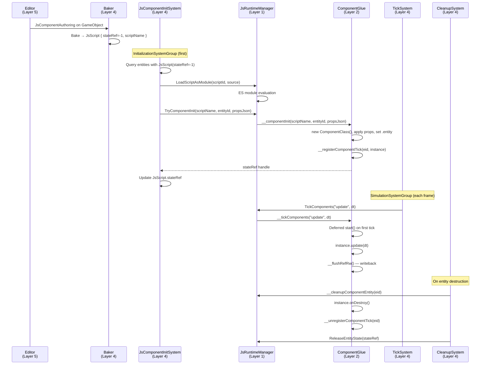
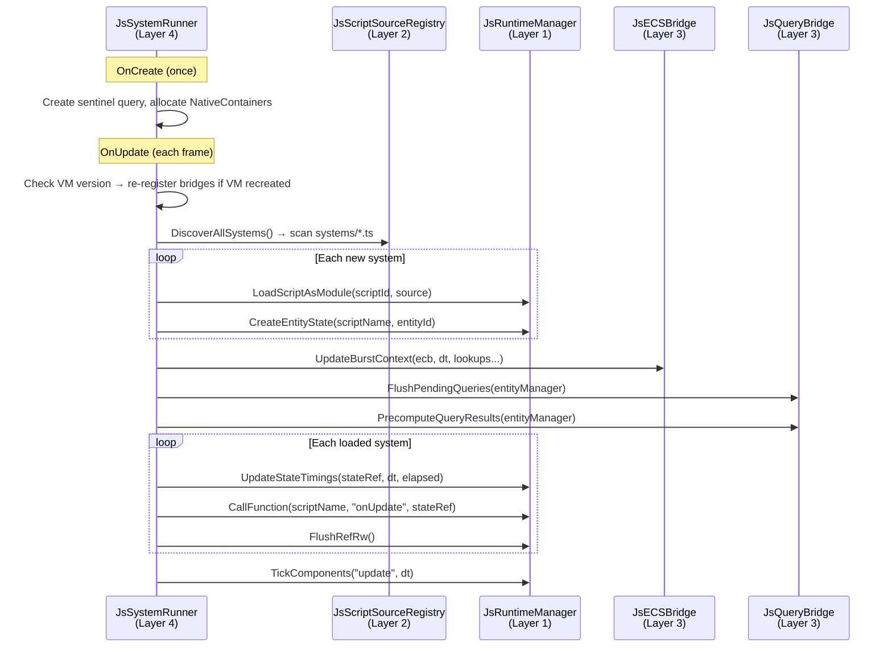
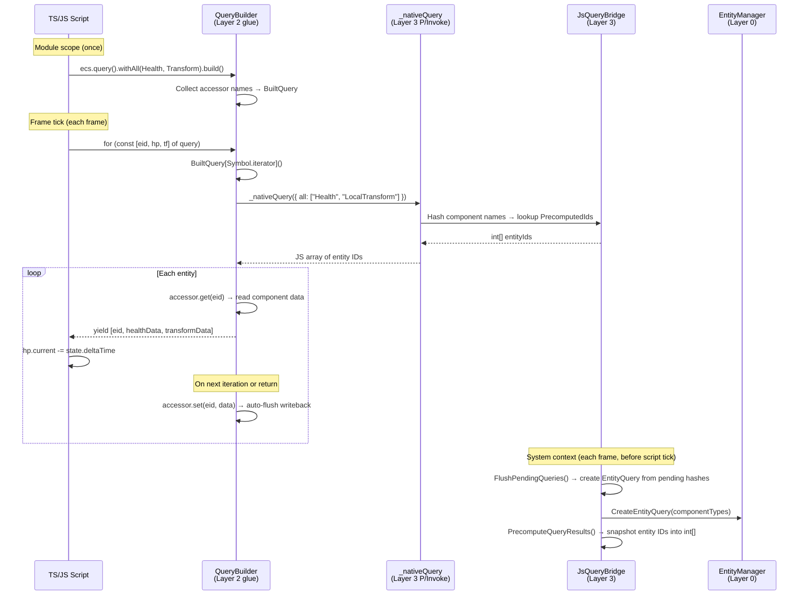
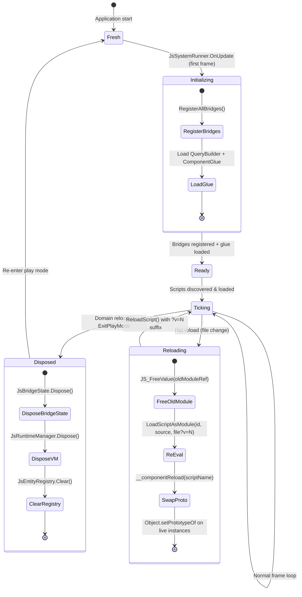
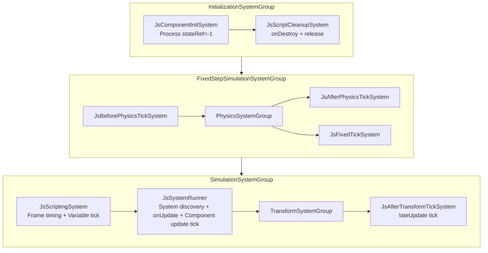
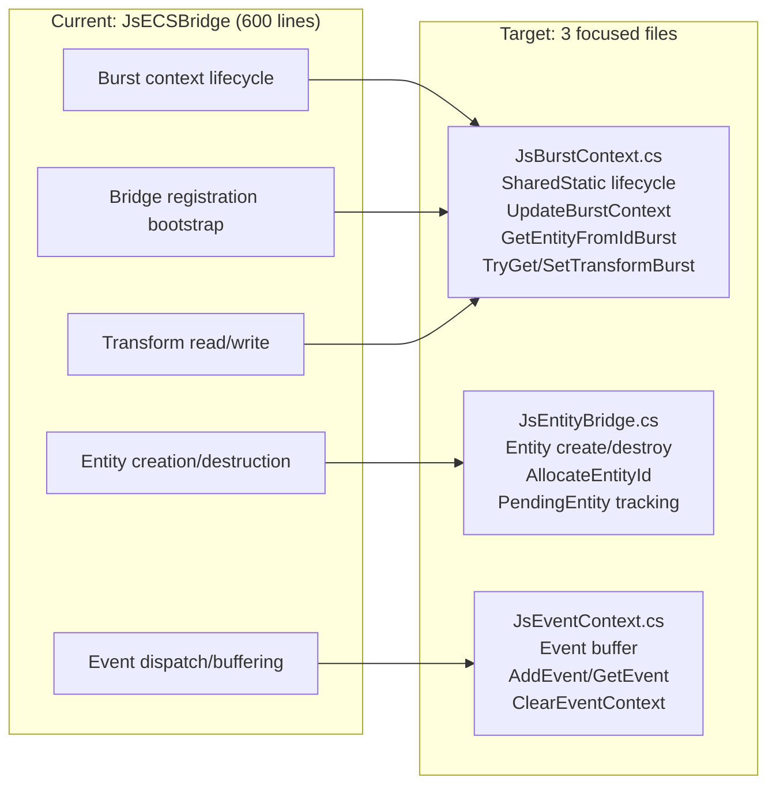
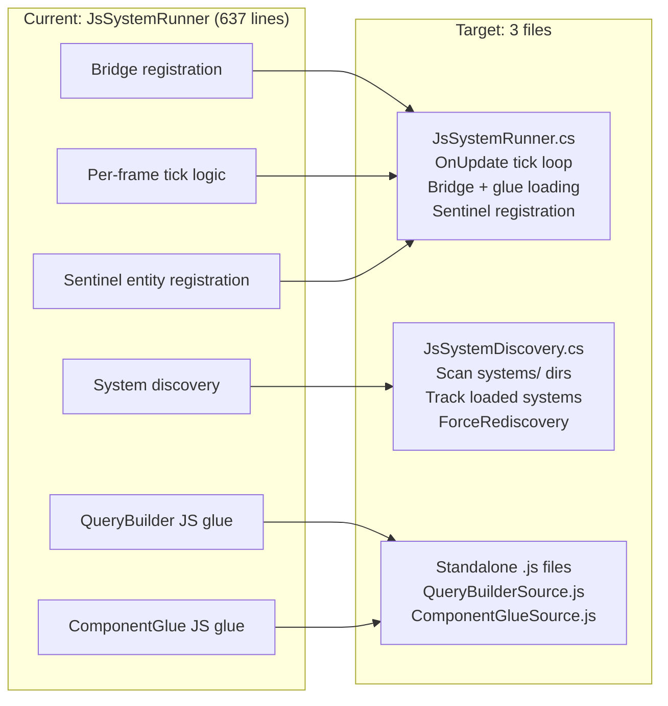
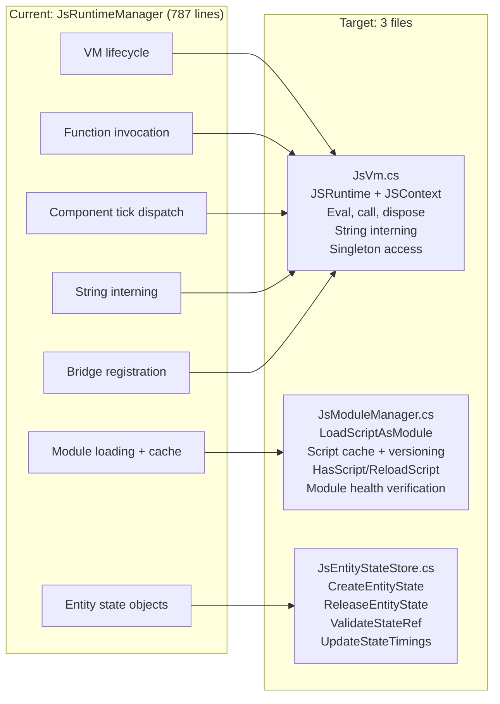

# unity.js Architecture

## Why This Document Exists

Every change to unity.js has historically broken multiple features. Analysis of 10 conversations and 100+ commits reveals three systemic causes:

1. **God objects with hidden coupling** — JsECSBridge (600+ lines), JsSystemRunner (discovery + codegen + tick), JsRuntimeManager (singleton doing everything)
2. **No clear layer boundaries** — changes to one subsystem ripple into others through shared static state
3. **Tests that prove nothing** — unit tests with `EvalVoid()` shortcuts pass while real play-mode lifecycle is broken

This document defines the target architecture. Every file belongs to exactly one layer. Every dependency points down, never up.

---

## Layer Model

```mermaid
graph TB
    subgraph "Layer 5: Editor Tools"
        STUBS[JsTypeStubGenerator]
        WATCH[TsFileWatcher]
        STATUS[TsStatusBarIndicator]
    end

    subgraph "Layer 4.5: Runtime Transpilation"
        TRANSPILER[JsTranspiler / Sucrase]
        HOT[JsHotReloadSystem]
    end

    subgraph "Layer 4: ECS Integration"
        INIT[JsComponentInitSystem]
        RUNNER[JsSystemRunner]
        TICK[Tick Systems]
        CLEANUP[JsScriptCleanupSystem]
        EVENT[JsEventDispatcher]
    end

    subgraph "Layer 3: Bridge Registry"
        COMPREG[JsComponentRegistry]
        BRIDGE_STATE[JsBridgeState]
        MATH_B[JsMathCompiled]
        ENT_B[JsEntitiesBridge]
        LOG_B[JsLogBridge]
        COLOR_B[JsColorsBridge]
        QUERY_B[JsQueryBridge]
        COMP_STORE[JsComponentStore]
        ENT_REG[JsEntityRegistry]
        SYS_B[JsSystemBridge]
    end

    subgraph "Layer 2: Module System"
        LOADER[JsModuleLoader]
        BUILTIN[JsBuiltinModules]
        SEARCH[JsScriptSearchPaths]
        SOURCE[JsScriptSourceRegistry]
        GLUE_Q[QueryBuilderSource.js]
        GLUE_C[ComponentGlueSource.js]
    end

    subgraph "Layer 1: QuickJS Engine"
        VM[JsRuntimeManager]
        QJS[QJS P/Invoke]
        NATIVE[libquickjs.so/dll]
    end

    subgraph "Layer 0: Native Libraries"
        ENTITIES[Unity.Entities]
        MATH[Unity.Mathematics]
        BURST[Unity.Burst]
        PHYSICS[Unity.Physics]
        INPUT[Unity.InputSystem]
        ALINE_LIB[ALINE]
    end

    TSC --> SOURCE
    STUBS --> COMPREG
    HOT --> VM
    WATCH --> TSC

    INIT --> VM
    INIT --> COMPREG
    INIT --> ENT_REG
    RUNNER --> VM
    RUNNER --> COMPREG
    RUNNER --> QUERY_B
    RUNNER --> SOURCE
    TICK --> VM
    TICK --> COMPREG
    CLEANUP --> VM
    CLEANUP --> ENT_REG

    COMPREG --> BUILTIN
    QUERY_B --> COMPREG
    QUERY_B --> ENT_REG
    COMP_STORE --> COMPREG
    COMP_STORE --> ENT_REG
    ENT_B --> ENT_REG

    LOADER --> SEARCH
    LOADER --> BUILTIN
    LOADER --> SOURCE

    VM --> QJS
    VM --> LOADER
    QJS --> NATIVE

    INIT --> ENTITIES
    RUNNER --> ENTITIES
    ENT_REG --> ENTITIES
    ENT_REG --> BURST
    MATH_B --> MATH
```



### Layer Rules

| Rule | Description |
|------|-------------|
| **One-way deps** | Layer N depends only on layers < N. Never up. |
| **No cross-layer statics** | SharedStatic lives in Layer 1 (VM) or Layer 3 (Bridge). Systems (Layer 4) read them, never own them. |
| **Bridge registration is atomic** | All bridges registered before any script evaluates. Single entry point: `JsComponentRegistry.RegisterAllBridges()`. |
| **Module loading is idempotent** | `LoadOrGet(scriptId, source) → handle`. Same input = same output. |
| **Query creation in system context only** | Never inside P/Invoke callbacks. Deferred via `PendingQueries → FlushPendingQueries()`. |
| **ECB is the only write path** | No `EntityManager.SetComponentData()` from JS. All writes via `EntityCommandBuffer`. |
| **Initialization is deterministic** | Exact system ordering via `[UpdateBefore]`/`[UpdateAfter]`. No implicit assumptions. |

---

## Feature Catalog

### Layer 1: User-Facing Features

These are what TypeScript developers interact with.

| Feature | JS API | Bridge File |
|---------|--------|-------------|
| **Component scripting** | `class Comp extends Component { start(), update(dt), fixedUpdate(dt), lateUpdate(dt), onDestroy() }` | `ComponentGlueSource.js` |
| **System scripting** | `export function onUpdate(state) {}` in `systems/*.ts` | `JsSystemRunner.cs` |
| **ECS queries** | `ecs.query().withAll(X).withNone(Y).build()` → iterable `[eid, ...comps]` | `QueryBuilderSource.js`, `JsQueryBridge.cs` |
| **Component access** | `ecs.get(accessor, eid)`, `ecs.add(eid, comp)`, `ecs.has()`, `ecs.remove()` | `JsEntitiesBridge.cs`, `JsComponentStore.cs` |
| **Entity ops** | `entities.create(pos)`, `entities.destroy(eid)`, `entities.addScript()` | `JsEntitiesBridge.cs` |
| **Math** | `float2/3/4`, swizzles, `math.sin/cos/lerp/dot/normalize/cross` | `JsMathCompiled.cs` |
| **Colors** | `colors.hsvToRgb()`, `colors.oklabToRgb()` | `JsColorsBridge.cs` |
| **Logging** | `log.info()`, `log.warn()`, `log.error()` | `JsLogBridge.cs` |
| **Input** | `input.readValue(action)`, `input.wasPressed()`, `input.isHeld()` | `JsInputBridge.cs` |
| **Drawing** | `draw.line()`, `draw.wireSphere()`, `draw.solidBox()`, `draw.label2d()` | `JsDrawBridge.cs` |
| **Spatial queries** | `spatial.query(tag, shape)`, `spatial.trigger(eid, tag, shape).on('enter', cb)` | `JsSpatialBridge.cs`, `JsSpatialTriggerBridge.cs` |
| **System info** | `system.deltaTime()`, `system.time()`, `system.random()` | `JsSystemBridge.cs` |
| **Hot reload** | Edit `.ts` → detect change → transpile → live update | `JsHotReloadSystem`, `JsTranspiler` |
| **Authoring** | `JsComponentAuthoring` MonoBehaviour on GameObjects | `JsComponentAuthoring.cs` |

### Layer 2: Architectural Features

Internal systems that make the above work.

| Subsystem | Responsibility | Current File(s) | Target |
|-----------|---------------|-----------------|--------|
| **VM lifecycle** | Create/dispose QuickJS runtime+context | `JsRuntimeManager.cs` (787 lines) | Split: `JsVm` (thin VM wrapper) + `JsModuleManager` + `JsEntityStateStore` |
| **Module loading** | ES module resolution, cache invalidation | `JsModuleLoader.cs` (176 lines) | Keep as-is (clean) |
| **Script discovery** | Scan `systems/` and `components/` dirs | `JsScriptSearchPaths.cs` (239 lines) | Keep as-is (clean) |
| **Builtin modules** | Synthetic `unity.js/*` imports | `JsBuiltinModules.cs` (223 lines) | Keep as-is (clean) |
| **Bridge registration** | C# types → JS globals | `JsComponentRegistry.cs` (118 lines) | Keep as-is (clean) |
| **Bridge state** | Mutable state container | `JsBridgeState.cs` (60 lines) | Keep as-is (clean) |
| **Entity ID registry** | Persistent int↔Entity maps | `JsEntityRegistry.cs` (497 lines) | Reduce API surface |
| **Burst context** | SharedStatic for burst entity lookups | `JsECSBridge.cs` (600 lines) | Extract to `JsBurstContext.cs` |
| **Component init** | `stateRef=-1` → load module → init | `JsComponentInitSystem.cs` | Clean up, move bridge reg to bootstrap |
| **Tick dispatch** | Route update/fixedUpdate/lateUpdate | `JsTickSystemBase.cs` + concrete systems | Keep (already clean) |
| **Query bridge** | Cache EntityQuery, defer creation | `JsQueryBridge.cs` (266 lines) | Keep as-is (clean) |
| **Component store** | JS-defined component data + tag pool | `JsComponentStore.cs` (622 lines) | Keep (complex but self-contained) |
| **Script cleanup** | onDestroy(), release state | `JsScriptCleanupSystem.cs` (79 lines) | Keep as-is (clean) |
| **JS glue (query)** | QueryBuilder, iterator, auto-flush | Embedded in `JsSystemRunner.cs` (160 lines) | Extract to standalone `.js` file |
| **JS glue (component)** | Component base class, tick registry, refRW | Embedded in `JsSystemRunner.cs` (170 lines) | Extract to standalone `.js` file |
| **Runtime transpilation** | TypeScript → JavaScript via Sucrase in QuickJS | `JsTranspiler.cs` | On-demand, no build step |
| **Type stub generation** | Auto-generate `.d.ts` | `JsTypeStubGenerator.cs` | Keep as-is (clean) |
| **String interning** | Zero-per-frame allocations | `JsRuntimeManager.cs` | Move to `JsVm` |

### Layer 3: Native Libraries

External dependencies consumed by unity.js.

| Library | What We Use | Binding |
|---------|-------------|---------|
| **QuickJS-ng** | JS runtime, context, eval, module API, value marshaling, GC | P/Invoke → `QJS.cs` |
| **Unity.Entities** | World, EntityManager, ECB, ISystem, SystemBase, EntityQuery, ComponentLookup | Direct C# |
| **Unity.Mathematics** | float2/3/4, quaternion, math.* | Direct C#, mirrored to JS |
| **Unity.Burst** | SharedStatic, BurstCompile, MonoPInvokeCallback | Attributes + SharedStatic |
| **Unity.Collections** | NativeArray, NativeHashMap, UnsafeList, FixedString | Direct C# |
| **Unity.Transforms** | LocalTransform, LocalToWorld | ComponentLookup |
| **Unity.Logging** | Log.Info/Warning/Error | Direct C# |
| **Unity.Physics** | PhysicsVelocity, PhysicsDamping, collision | Optional integration |
| **Unity.InputSystem** | InputAction reading | Optional integration |
| **ALINE** | CommandBuilder for debug drawing | Optional integration |

---

## Component Lifecycle



---

## System Lifecycle



---

## Query Pipeline



**Critical invariant:** `FlushPendingQueries()` and `PrecomputeQueryResults()` run in system context (`JsSystemRunner.OnUpdate`) BEFORE any scripts tick. `_nativeQuery()` P/Invoke callback only reads the precomputed snapshot — it never calls `EntityManager.CreateEntityQuery()`.

---

## Domain Reload & Hot Reload State Machine



### State Cleared at Each Transition

| Transition | What Gets Cleared |
|------------|-------------------|
| **→ Fresh** | Everything. VM, context, all script refs, entity registry, bridge state. |
| **→ Initializing** | Nothing cleared — building up from empty. |
| **→ Ready** | Bridges locked (no more registration after this point). |
| **→ Ticking** | Nothing cleared — accumulating system state. |
| **→ Disposed** | BridgeState (query cache, component store, entity components), VM (JSRuntime + JSContext + all JSValues), EntityRegistry (id↔entity maps, pending). |
| **→ Reloading** | Old module JSValue freed. Script cache entry replaced. Component instances get new prototype (live instances preserved). |

---

## ECS System Ordering



### Per-Frame Execution Order

1. **JsComponentInitSystem** — Process new entities: load scripts, call `__componentInit`, set stateRef
2. **JsScriptCleanupSystem** — Process destroyed entities: call `onDestroy`, release state
3. **JsBeforePhysicsTickSystem** — beforePhysics tick group (if Physics integration)
4. **PhysicsSystemGroup** — Unity Physics step
5. **JsFixedTickSystem** — fixedUpdate tick group + `__tickComponents("fixedUpdate", fixedDt)`
6. **JsAfterPhysicsTickSystem** — afterPhysics tick group
7. **JsScriptingSystem** — Update frame timing, tick Variable entity scripts, dispatch events
8. **JsSystemRunner** — Discover systems, register bridges, UpdateBurstContext, FlushPendingQueries, PrecomputeQueryResults, call `onUpdate(state)` on all systems, `__tickComponents("update", dt)`
9. **TransformSystemGroup** — Unity transform propagation
10. **JsAfterTransformTickSystem** — lateUpdate tick group + `__tickComponents("lateUpdate", dt)`

---

## God Object Decomposition (Target)

### JsECSBridge.cs (600 lines → 3 files)



### JsSystemRunner.cs (637 lines → 3 files)



### JsRuntimeManager.cs (787 lines → 3 files)



---

## Architectural Principles

### 1. One-Way Dependencies
Layer N depends only on layers below it. If you're writing code in Layer 4 (ECS Integration) and need to `using` something from Layer 5 (Editor), the design is wrong.

### 2. No Ambient Static State
All mutable state lives in exactly one of:
- `JsBridgeState` (owned by VM, disposed atomically)
- `SharedStatic<T>` for Burst-accessible data (owned by `JsBurstContext`)
- `NativeContainers` on system entities (owned by ECS lifecycle)

No scattered `static` fields on bridge classes. If a bridge needs frame-scoped state, it goes through `JsBurstContext`.

### 3. Deterministic Initialization
System ordering is explicit via attributes. The initialization sequence is:

1. `JsComponentInitSystem.OnStartRunning` → register bridges, load glue
2. `JsComponentInitSystem.OnUpdate` → process stateRef=-1 entities
3. `JsSystemRunner.OnUpdate` → discover systems, UpdateBurstContext, tick

No system assumes another has run unless connected by `[UpdateAfter]`.

### 4. Idempotent Module Loading
`LoadScriptAsModule(scriptId, source, filename)` must be idempotent:
- Same (scriptId, source) → return cached handle, no side effects
- Different source for same scriptId → invalidate cache, re-evaluate
- Cache key includes source hash, not just scriptId

### 5. Bridge Registration is Atomic
All bridges are registered in a single batch via `JsComponentRegistry.RegisterAllBridges(ctx)`. This runs exactly once per VM lifetime (or once per VM recreation). No bridge is registered after the first script evaluates.

### 6. Query Creation in System Context Only
`EntityManager.CreateEntityQuery()` must never be called inside a P/Invoke callback. The current workaround (deferred via `PendingQueries` → `FlushPendingQueries()`) is correct and should remain.

### 7. ECB is the Only Write Path
All entity/component mutations from JS go through `EntityCommandBuffer`. No direct `EntityManager.SetComponentData()` from P/Invoke callbacks. ECB playback happens at `EndSimulationEntityCommandBufferSystem`.

---

## File Ownership Map

### Layer 1: QuickJS Engine

| File | Responsibility |
|------|---------------|
| `Runtime/QuickJS/QJS.cs` | P/Invoke bindings to libquickjs |
| `Runtime/QuickJS/QJSShimCallback.cs` | Delegate type for native callbacks |
| `Runtime/Plugins/*` | Native binaries (linux/win/osx) |

### Layer 2: Module System

| File | Responsibility |
|------|---------------|
| `Runtime/JsRuntime/Core/JsRuntimeManager.cs` | VM singleton → **target: split to JsVm + JsModuleManager + JsEntityStateStore** |
| `Runtime/JsRuntime/Core/JsModuleLoader.cs` | ES module resolution callbacks |
| `Runtime/JsRuntime/Core/JsBuiltinModules.cs` | Synthetic `unity.js/*` modules |
| `Runtime/JsRuntime/Core/JsScriptSearchPaths.cs` | Priority-ordered search paths |
| `Runtime/JsRuntime/Core/JsScriptSourceRegistry.cs` | Script source discovery |
| `Runtime/JsRuntime/Core/FileSystemScriptSource.cs` | Filesystem script source |
| `QueryBuilderSource.js` *(target: extract from JsSystemRunner)* | Query builder + iterator glue |
| `ComponentGlueSource.js` *(target: extract from JsSystemRunner)* | Component lifecycle glue |

### Layer 3: Bridge Registry

| File | Responsibility |
|------|---------------|
| `Runtime/JsECS/Core/JsComponentRegistry.cs` | C#↔JS component type mapping |
| `Runtime/JsECS/Core/JsBridgeState.cs` | Mutable state container |
| `Runtime/JsECS/Core/JsECSBridge.cs` | **target: split to JsBurstContext + JsEntityBridge + JsEventContext** |
| `Runtime/JsECS/Core/JsEntityRegistry.cs` | Entity ID↔Entity maps |
| `Runtime/JsECS/Core/JsQueryBridge.cs` | Entity query caching |
| `Runtime/JsECS/Core/JsComponentStore.cs` | JS-defined component storage |
| `Runtime/JsECS/Core/Bridge/JsMathCompiled.cs` | Math bridge functions |
| `Runtime/JsECS/Core/Bridge/JsEntitiesBridge.cs` | Entity ops bridge |
| `Runtime/JsECS/Core/Bridge/JsLogBridge.cs` | Logging bridge |
| `Runtime/JsECS/Core/Bridge/JsColorsBridge.cs` | Color conversion bridge |
| `Runtime/JsECS/Core/JsSystemBridge.cs` | System info bridge |

### Layer 4: ECS Integration

| File | Responsibility |
|------|---------------|
| `Runtime/JsECS/Systems/JsSystemRunner.cs` | System discovery + tick → **target: extract JsSystemDiscovery + JS glue files** |
| `Runtime/JsECS/Systems/JsScriptingSystem.cs` | Frame timing + Variable tick |
| `Runtime/JsECS/Systems/Support/JsComponentInitSystem.cs` | Process stateRef=-1 entities |
| `Runtime/JsECS/Systems/Support/JsScriptCleanupSystem.cs` | Cleanup on entity destruction |
| `Runtime/JsECS/Systems/Tick/JsTickSystemBase.cs` | Shared tick helper |
| `Runtime/JsECS/Systems/Tick/JsAfterTransformTickSystem.cs` | lateUpdate tick |
| `Runtime/JsECS/Components/*` | ECS component definitions |
| `Runtime/JsECS/Authoring/*` | Baker + MonoBehaviour |

### Layer 5: Editor Tools

| File | Responsibility |
|------|---------------|
| `Editor/TsFileWatcher.cs` | Watch .ts changes in editor |
| `Editor/TsStatusBarIndicator.cs` | Transpilation status in status bar |
| `Runtime/JsRuntime/Core/JsTranspiler.cs` | Runtime Sucrase transpilation |
| `Runtime/JsECS/Systems/JsHotReloadSystem.cs` | FileSystemWatcher hot reload (editor + builds) |
| `Editor/JsHotReloadSystem.cs` | Runtime hot reload |
| `Editor/JsTypeStubGenerator.cs` | Auto-generate .d.ts |
| `Editor/JsComponentAuthoringEditor.cs` | Inspector UI |
| `Editor/JsPropertyParser.cs` | Property annotation parsing |

### Integrations (Optional Layer 3-4)

| Integration | Bridge File | System File |
|-------------|-------------|-------------|
| **Physics** | — | `JsFixedTickSystem.cs`, `JsBeforePhysicsTickSystem.cs`, `JsAfterPhysicsTickSystem.cs` |
| **InputSystem** | `JsInputBridge.cs` | — |
| **ALINE** | `JsDrawBridge.cs` | — |
| **CharacterController** | `JsCharacterBridge.cs` | — |
| **Spatial** | `JsSpatialBridge.cs`, `JsSpatialTriggerBridge.cs` | `MiniSpatialSystem.cs` |
| **QuantumConsole** | — | — (placeholder) |

---

## Key Invariants

These are the rules that, when violated, cause the failures cataloged in the root cause analysis.

| Invariant | Violation → Failure | Prevention |
|-----------|---------------------|------------|
| `JS_Eval` buffer must be null-terminated | `SyntaxError: invalid UTF-8 sequence` | `GetBytes(code + '\0')`, `len = bytes.Length - 1` |
| `JS_SetPropertyStr` consumes the value | Use-after-free, dangling pointers | Never `JS_FreeValue` after `SetPropertyStr` |
| Bridges ready before any script evaluates | `TypeError: not a function` at module scope | Atomic `RegisterAllBridges()` before first `LoadScriptAsModule()` |
| Module loading is idempotent | Duplicate `JSModuleDef`, TDZ errors | Cache by (scriptId, sourceHash), guard against duplicate loads |
| `UpdateBurstContext()` before any tick | `GetEntityFromIdBurst` returns `Entity.Null` silently | Every tick system calls `UpdateBurstContext()` in `OnUpdate` before any JS call |
| `ecs.query()` at module scope, not inside `onUpdate` | Query rebuilt every frame, memory waste | Lint rule + runtime warning |
| `EntityManager.CreateEntityQuery()` never in P/Invoke | Query matches zero entities | Defer via `PendingQueries → FlushPendingQueries()` |
| Transpilation errors must not crash the runtime | Broken mod = broken game | `JsTranspiler.Transpile()` returns null on error, callers skip broken scripts |

### Known Bugs

| Bug | Root Cause | Test | Fix |
|-----|-----------|------|-----|
| *(none currently)* | | | |

---

## TypeScript Type System

Types are assembled in `Library/unity.js/types/` on every domain reload:

1. `globals.d.ts` — copied from `TypeDefinitions~/` (float2/3/4, ComponentAccessor, etc.)
2. `modules.d.ts` — copied from `TypeDefinitions~/` (module declarations for `unity.js/*`)
3. `unity.d.ts` — auto-generated by `JsTypeStubGenerator` from `[JsBridge]` C# types

A `tsconfig.json` is auto-generated at project root for IDE intellisense (`noEmit: true`). Runtime transpilation uses Sucrase loaded into QuickJS — no tsc or Node.js required.

---

## Test Architecture (Target)

### Requirements

1. **Only high-level component use** — Tests interact with unity.js the same way Authoring or `.ts` scripting would. No `RegisterImmediate()`, no `EvalVoid()`, no `JsBridgeTestFixture`. If a real user can't call it from TypeScript, the test shouldn't call it either.

2. **TypeScript fixtures represent real use** — Each test has a `.ts` fixture file that is a realistic script (component or system). No mocking anything except a **single input layer per test**. The input is the controlled variable; everything else runs through the real pipeline.

3. **Inputs correlate to outputs, assertions from first principles** — Every test follows: `given input X, the system must produce output Y, where Y is derivable from X by the documented rules`. No "assert it changed" — assert the *exact value* or *exact relationship*.

### The Input→Output Contract

Each E2E test has exactly three parts:

```
INPUT (controlled)     →  PIPELINE (real, untouched)  →  OUTPUT (asserted from first principles)
─────────────────────     ────────────────────────────    ─────────────────────────────────────────
TS fixture with known     Full lifecycle:                 ECS component values read via
initial values +          InitSystem → Tick → Transform   EntityManager after N frames
SceneFixture.Spawn()
```

**Input layer** = the `.ts` fixture file with hardcoded values + `SceneFixture.Spawn()` calls. These are the only things the test controls.
**Pipeline** = the entire unity.js runtime. EnterPlayMode, JsComponentInitSystem, JsSystemRunner, tick systems. Untouched.
**Output** = ECS component data (LocalTransform, custom components) read from the World after the pipeline has run.

### SceneFixture — Programmatic Scene DSL

Instead of Unity scene files (closed YAML format, fragile, hard for agents to create), tests use `SceneFixture` — a programmatic DSL that creates entities the same way `JsScriptBufferAuthoring.Baker` does.

```csharp
// SceneFixture creates entities identical to what baking produces:
// JsScript buffer (stateRef=-1), JsEntityId, LocalTransform, JsEvent buffer.
// JsComponentInitSystem processes them through the real fulfillment pipeline.

using var scene = new SceneFixture(world);

// Spawn a component entity (like putting JsComponentAuthoring on a GameObject)
var slime = scene.Spawn("components/slime_wander", new float3(0, 1, 0));

// Spawn with property overrides (like setting values in the Inspector)
var fast = scene.Spawn("components/movement", float3.zero, @"{""speed"":50}");

// Spawn with multiple scripts (like multiple JsComponentAuthoring on one GO)
var multi = scene.Spawn(new[] { "components/health", "components/armor" });

// Spawn a bare entity (no scripts, just transform + ID — for query targets)
var target = scene.SpawnBare(new float3(10, 0, 0));

// Add C# components for test preconditions
scene.AddComponent(target, new PhysicsVelocity { Linear = new float3(1, 0, 0) });

// After frames run, read results directly from ECS
var pos = scene.GetPosition(slime);        // LocalTransform.Position
var eid = scene.GetEntityId(slime);        // JsEntityId.value
var ok = scene.AllFulfilled();             // all stateRef >= 0?

// Dispose destroys all entities (like unloading a scene)
scene.Dispose();  // or `using` does it automatically
```

**Why not scene files:**
- Scene files are closed YAML — fragile, hard for agents to create/modify correctly
- Each test would need a scene asset, polluting the project
- Programmatic setup is explicit, readable, and version-controllable
- `SceneFixture.Spawn()` produces exactly the same ECS components as baking

**Key invariant:** `SceneFixture` never bypasses the pipeline. It creates entities with `stateRef=-1` and lets `JsComponentInitSystem` do the real work. The test never calls `LoadScriptAsModule` or `CallInit` directly.

### Assertion Rules

| Rule | Example |
|------|---------|
| **Derive expected values from the input** | If fixture sets `speed = 5` and test runs 10 frames at `dt=0.02`, expected displacement = `5 * 0.02 * 10 = 1.0` (tolerance for frame timing) |
| **Assert exact relationships, not "changed"** | `Assert.AreEqual(startPos + float3(1,0,0), endPos, tolerance)` not `Assert.AreNotEqual(startPos, endPos)` |
| **One input layer per test** | The `.ts` fixture is the input. Don't also mock the bridge, or inject entities manually, or call EvalVoid |
| **Tolerance from physics** | Frame timing has jitter. Tolerance = `speed * maxDt * 2` (two frames of slack). Document why each tolerance exists |

### Fixture Design

Each feature test has a companion `.ts` fixture in `Tests~/Fixtures/`:

```typescript
// Tests~/Fixtures/components/lifecycle_probe.ts
import { Component } from 'unity.js/ecs'

// INPUT: known initial values, deterministic behavior
export default class LifecycleProbe extends Component {
  startCalled = 0     // counts start() invocations
  updateCount = 0     // counts update() invocations
  lastDt = 0          // captures last deltaTime

  start() {
    this.startCalled = 1
  }

  update(dt: number) {
    this.updateCount++
    this.lastDt = dt
  }
}
```

```typescript
// Tests~/Fixtures/systems/movement_probe.ts
import * as ecs from 'unity.js/ecs'
import { LocalTransform } from 'unity.js/components'

// INPUT: move all entities with LocalTransform by (1, 0, 0) * dt
const query = ecs.query().withAll(LocalTransform).build()

export function onUpdate(state: { deltaTime: number }) {
  for (const [eid, tf] of query) {
    tf.Position.x += 1.0 * state.deltaTime
  }
}
```

```typescript
// Tests~/Fixtures/systems/math_probe.ts
import * as ecs from 'unity.js/ecs'

// INPUT: exercise math operations with known values, store results in globals
globalThis.__mathResults = {
  dot_f3: math.dot(float3(1, 0, 0), float3(0, 1, 0)),           // expected: 0
  len_f3: math.length(float3(3, 4, 0)),                          // expected: 5
  norm_f3: math.normalize(float3(0, 0, 5)),                      // expected: float3(0, 0, 1)
  lerp_f: math.lerp(0, 10, 0.3),                                 // expected: 3
  cross_f3: math.cross(float3(1, 0, 0), float3(0, 1, 0)),        // expected: float3(0, 0, 1)
  sin_half_pi: math.sin(math.PI / 2),                             // expected: 1
  clamp_over: math.clamp(15, 0, 10),                              // expected: 10
  distance_f3: math.distance(float3(0, 0, 0), float3(3, 4, 0)),  // expected: 5
}

export function onUpdate() {}
```

### C# Test Structure

```csharp
// Every E2E test follows this pattern:
[UnityTest]
public IEnumerator ComponentStart_CalledExactlyOnce()
{
    yield return new EnterPlayMode();

    var world = World.DefaultGameObjectInjectionWorld;
    using var scene = new SceneFixture(world);

    // INPUT: spawn entity with lifecycle_probe component
    var entity = scene.Spawn("components/lifecycle_probe");

    // PIPELINE: let real systems process (init + N frames)
    for (var i = 0; i < 5; i++) yield return null;
    Assert.IsTrue(scene.AllFulfilled(), "Script must be fulfilled by InitSystem");

    // OUTPUT: read JS state through the real bridge
    var vm = JsRuntimeManager.Instance;
    var eid = scene.GetEntityId(entity);
    var startCalled = QJS.ToInt32(vm.EvalGlobal(vm.Context,
        $"LifecycleProbe.get({eid})?.startCalled ?? -1", "test"));

    // ASSERT: from first principles — start() is called exactly once
    Assert.AreEqual(1, startCalled,
        "start() must be called exactly once per component lifecycle");

    yield return new ExitPlayMode();
    // scene.Dispose() called automatically by `using`
}
```

### Test Catalog

```
Tests/
  EditMode/
    Features/
      ComponentLifecycleE2ETests.cs
        - Start_CalledExactlyOnce
        - Update_CalledEveryFrame (assert updateCount == frameCount)
        - FixedUpdate_CalledAtFixedRate
        - LateUpdate_CalledAfterTransforms
        - OnDestroy_CalledOnEntityDestruction
        - MultipleComponents_IndependentLifecycles

      SystemExecutionE2ETests.cs
        - System_AutoDiscoveredFromSystemsDir
        - System_OnUpdateReceivesDeltaTime (assert dt > 0, dt < maxDt)
        - System_ModifiesComponentData (movement probe: assert position changed by speed*dt*frames)
        - MultipleSystemsExecuteInOrder

      QueryPipelineE2ETests.cs
        - Query_WithAll_ReturnsMatchingEntities (known entity count)
        - Query_WithNone_ExcludesEntities
        - Query_IteratorWritesBack (modify in loop, read next frame)
        - Query_AtModuleScope_Persistent (same results frame N and frame N+1)

      MathBridgeE2ETests.cs
        - Math_DotProduct (assert dot(orthogonal) == 0, dot(parallel) == |a|*|b|)
        - Math_Length (assert length(3,4,0) == 5 — Pythagorean)
        - Math_Normalize (assert length(normalize(v)) == 1 for any nonzero v)
        - Math_Lerp (assert lerp(a,b,0)==a, lerp(a,b,1)==b, lerp(a,b,0.5)==(a+b)/2)
        - Math_Cross (assert cross(x,y)==z, cross(y,x)==-z — right-hand rule)
        - Math_Trig (assert sin(PI/2)==1, cos(0)==1, sin(0)==0)
        - Math_Clamp (assert clamp(over,min,max)==max, clamp(under,min,max)==min)

      EntityCreationE2ETests.cs
        - Create_ReturnsValidId (assert id > 0)
        - Create_WithPosition_SetsLocalTransform (assert position matches input)
        - Destroy_RemovesEntity (assert entity gone after ECB playback)
        - AddScript_AttachesComponentToEntity

      HotReloadE2ETests.cs
        - Reload_UpdatesBehavior (mutate fixture → assert new output)
        - Reload_PreservesInstances (component .entity still valid)
        - Reload_MultipleRapid (3 reloads in quick succession)

      DomainReloadE2ETests.cs
        - EnterExitPlayMode_TwoCycles (enter → verify → exit → enter → verify)
        - NoTDZErrors_AfterReload (verify no ReferenceError exceptions)

      SpatialQueryE2ETests.cs
        - SphereQuery_ReturnsNearbyEntities (place entities at known distances, assert in/out radius)
        - Trigger_EnterFires_WhenOverlapping
        - Trigger_ExitFires_WhenSeparated

      InputBridgeE2ETests.cs
        - ReadValue_ReturnsZero_WhenNoInput (null-safe default)

      ColorBridgeE2ETests.cs
        - HsvToRgb_RedAtZeroDegrees (assert hsvToRgb(0,1,1) == float3(1,0,0))
        - RgbRoundTrip (assert rgbToHsv(hsvToRgb(h,s,v)) ≈ (h,s,v))

    Stress/
      VmRecreationStressTests.cs    — 5 rapid enter/exit cycles, no exceptions
      HotReloadStressTests.cs       — concurrent file mutations under load

    Verification/
      SlimeMovementE2ETests.cs      — real scene gate (existing)
      LiveReloadE2ETests.cs         — real scene gate (existing)

  PlayMode/
    (pure data structure tests only — KDTree, Shapes, BurstId, QJS bindings)
```

### Fixtures Directory

```
Tests~/Fixtures/
  components/
    lifecycle_probe.ts          — counts start/update/fixedUpdate/lateUpdate/onDestroy calls
    movement_component.ts       — moves entity by speed * dt each update
    destroy_probe.ts            — sets global flag in onDestroy
    multi_component_a.ts        — independent lifecycle tracking (component A)
    multi_component_b.ts        — independent lifecycle tracking (component B)
  systems/
    movement_probe.ts           — moves all LocalTransform entities by (1,0,0)*dt
    math_probe.ts               — exercises all math functions, stores results in globals
    query_probe.ts              — queries with withAll/withNone, stores entity counts in globals
    entity_creation_probe.ts    — calls entities.create(), stores created ID in global
    color_probe.ts              — exercises color conversions, stores results in globals
    spatial_probe.ts            — exercises spatial.query(), stores results in globals
    multi_system_a.ts           — sets global ordinal for execution order testing
    multi_system_b.ts           — sets global ordinal for execution order testing
```

### What Gets Deleted

All tests that use shortcuts to test behavior that should go through the real pipeline:

- `JsMathBridgeTests` → replaced by `MathBridgeE2ETests` with `math_probe.ts`
- `JsLogBridgeTests` → replaced by log assertions inside lifecycle E2E tests
- `JsComponentStoreTests` → replaced by `ComponentLifecycleE2ETests`
- `JsBridgeMarshalTests` → replaced by testing marshaling through real queries
- `JsComponentClassTests` → replaced by `ComponentLifecycleE2ETests` with real fixtures
- All `JsBridgeTestFixture`-based tests

### What Stays (no JS lifecycle involvement)

- `KDTreeTests`, `ShapeQueryTests`, `ShapeOverlapTests`, `SpatialShapeTests` — pure math
- `BurstIdAllocatorTests`, `BurstIdLookupTests` — pure data structures
- `QJSTests` — native QuickJS binding smoke tests (Layer 1)
