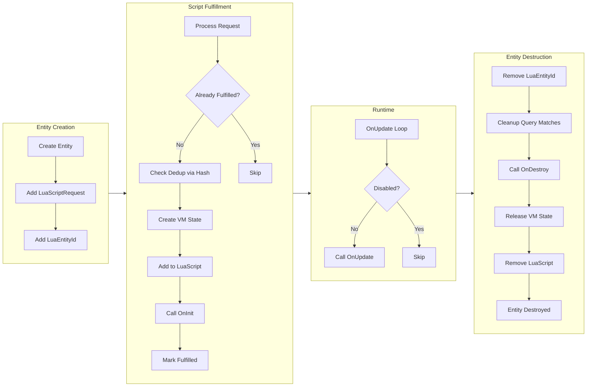
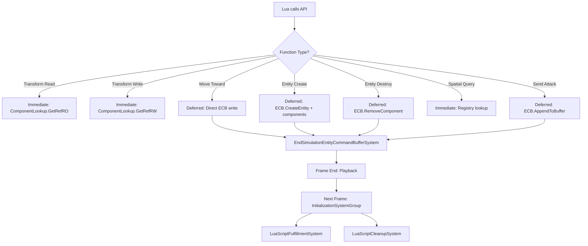
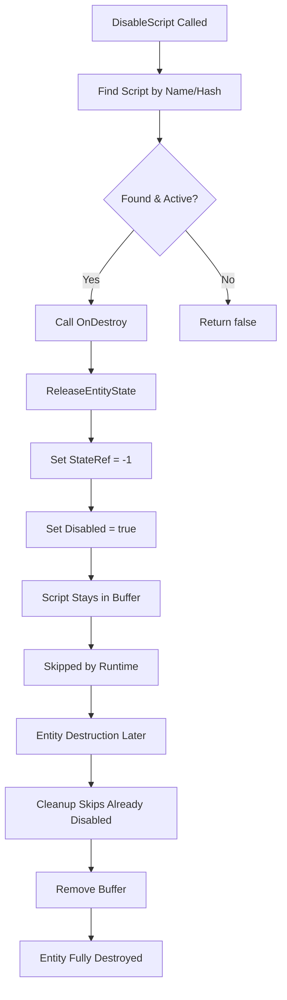

# Architecture Flowchart

This diagram shows the structural relationships and decision points in the LuaJIT ECS package.

```mermaid
flowchart TD
    subgraph Lua["Lua Layer (Scripts)"]
        LuaScript[/"Lua Script<br/>(OnInit, OnUpdate, OnEvent, OnDestroy)"/]
    end

    subgraph Core["Core (Runtime/Core)"]
        VM[LuaVMManager<br/>Singleton]
        Bridge[LuaECSBridge<br/>Static]
        PathUtil[LuaScriptPathUtility<br/>xxHash3]
        
        subgraph BridgeFunctions["Bridge API (Domain-Oriented)"]
            Entities[entities.*<br/>create/destroy<br/>add_script/has_script]
            Transform[transform.*<br/>get/set_position<br/>get_rotation/move_toward]
            Spatial[spatial.*<br/>distance/query_near<br/>get_entity_count]
            Events[events.*<br/>send_attack]
            Log[log.*<br/>info/debug<br/>warning/error]
        end
    end

    subgraph Systems["Systems (Runtime/Systems)"]
        subgraph InitGroup["InitializationSystemGroup"]
            Fulfill[LuaScriptFulfillmentSystem<br/>Request Processing]
            Cleanup[LuaScriptCleanupSystem<br/>OnDestroy + Cleanup]
        end
        subgraph SimGroup["SimulationSystemGroup"]
            LSS[LuaScriptingSystem<br/>Runtime Updates]
        end

        EndSimECB[EndSimulationEntityCommandBufferSystem<br/>Unity Built-in]
    end

    subgraph Components["Components"]
        LuaScriptReq[LuaScriptRequest Buffer<br/>IBufferElementData]
        LuaScriptComp[LuaScript Buffer<br/>ICleanupBufferElementData]
        LuaEventComp[LuaEvent Buffer]
        EntityId[LuaEntityId]
    end

    %% Lua to Bridge
    LuaScript -->|"API calls"| Bridge
    Bridge --> Entities
    Bridge --> Transform
    Bridge --> Spatial
    Bridge --> Events
    Bridge --> Log

    %% Core relationships
    VM -->|"manages"| LuaScript
    Bridge -->|"queries"| LSS
    Bridge -->|"writes to"| EndSimECB
    PathUtil -->|"generates hash"| LuaScriptReq

    %% System relationships
    Fulfill -->|"processes"| LuaScriptReq
    Fulfill -->|"creates"| LuaScriptComp
    Fulfill -->|"calls OnInit via"| VM
    Cleanup -->|"calls OnDestroy via"| VM
    Cleanup -->|"removes"| LuaScriptComp
    LSS -->|"calls OnUpdate via"| VM
    LSS -->|"structural changes"| EndSimECB

    %% Component relationships
    LSS -->|"reads (skip Disabled)"| LuaScriptComp
    LSS -->|"dispatches"| LuaEventComp
    Fulfill -->|"assigns"| EntityId

    %% Styling
    classDef mainThread fill:#46a,stroke:#24a,color:#fff
    classDef singleton fill:#a64,stroke:#842,color:#fff
    classDef lua fill:#64a,stroke:#428,color:#fff
    classDef cleanup fill:#a46,stroke:#824,color:#fff
    classDef unity fill:#4a6,stroke:#2a4,color:#fff

    class LSS,Fulfill mainThread
    class Cleanup cleanup
    class VM singleton
    class LuaScript lua
    class EndSimECB unity
```

## Component Responsibilities

| Layer   | Component                                  | Thread | Responsibility                                         |
| ------- | ------------------------------------------ | ------ | ------------------------------------------------------ |
| Core    | LuaVMManager                               | Main   | Lua state lifecycle, script loading, callback dispatch |
| Core    | LuaECSBridge                               | Main   | Static API surface for Lua → ECS communication         |
| Core    | LuaScriptPathUtility                       | N/A    | Script path resolution, xxHash3 hash generation        |
| Systems | LuaScriptFulfillmentSystem                 | Main   | Request processing, script init, OnInit, disabling     |
| Systems | LuaScriptCleanupSystem                     | Main   | OnDestroy callbacks, state release, entity cleanup     |
| Systems | LuaScriptingSystem                         | Main   | Runtime updates, event dispatch, direct ECB writes     |
| Systems | EndSimulationEntityCommandBufferSystem     | Main   | Unity built-in structural change playback              |

## Two-Buffer Architecture

## Decision Points

## Script Disabling Flow

## Static vs Instance Pattern

The package uses a hybrid approach:

1. **Static (Burst-compatible)**: `LuaECSBridge` uses static fields and `[MonoPInvokeCallback]` methods because Lua C function pointers cannot be instance methods.

2. **Singleton (Managed)**: `LuaVMManager` uses singleton pattern for easy access but could support interface injection for testing.

3. **System (ECS-managed)**: Systems are managed by the World and follow standard ECS lifecycle.

4. **Utility (Static)**: `LuaScriptPathUtility` provides static methods for path resolution and hash generation.
