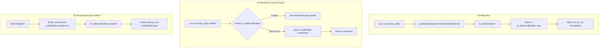
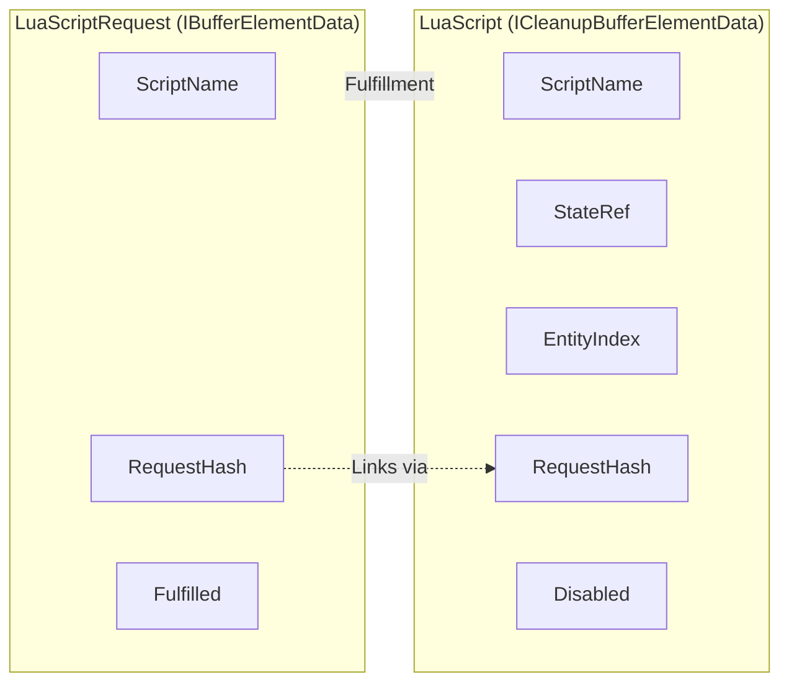

# Entity Lifecycle Sequence Diagram

This diagram shows the complete lifecycle of a Lua-scripted entity from creation to destruction using the two-buffer architecture.

```mermaid
sequenceDiagram
    participant Lua as Lua Script
    participant Bridge as LuaECSBridge
    participant LSS as LuaScriptingSystem
    participant Fulfill as LuaScriptFulfillmentSystem
    participant Cleanup as LuaScriptCleanupSystem
    participant ECB as EntityCommandBuffer
    participant EM as EntityManager
    participant VM as LuaVMManager

    Note over Lua,VM: Entity Creation (from Lua)

    Lua->>Bridge: ecs.create_entity({x, y, z})
    Bridge->>LSS: CreateEntityDeferred(position)
    LSS->>LSS: Allocate persistent ID (m_NextEntityId++)
    LSS->>ECB: CreateEntity()
    LSS->>ECB: AddComponent(LocalTransform)
    LSS->>ECB: AddComponent(LuaEntityId)
    LSS->>ECB: AddBuffer<LuaScriptRequest>()
    LSS->>ECB: AddBuffer<LuaEvent>()
    LSS->>LSS: Track in m_DeferredEntities[id] = entity
    LSS-->>Bridge: entityId
    Bridge-->>Lua: entityId (usable immediately)

    Lua->>Bridge: ecs.add_script(entityId, "my_script")
    Bridge->>LSS: AddScriptDeferred(entityId, scriptName)
    LSS->>LSS: Generate RequestHash via xxHash3
    LSS->>ECB: AppendToBuffer<LuaScriptRequest>(entity, request)
    LSS-->>Bridge: success
    Bridge-->>Lua: true

    Note over ECB,EM: Frame End - ECB Playback
    ECB->>EM: Playback all deferred operations
    EM->>EM: Entity now exists in world

    Note over Fulfill,VM: Next Frame - Script Fulfillment (InitializationSystemGroup)

    Fulfill->>Fulfill: Query entities with LuaScriptRequest
    Fulfill->>Fulfill: Find unfulfilled request (!Fulfilled)
    Fulfill->>Fulfill: Check dedup: no existing LuaScript with same RequestHash
    Fulfill->>VM: LoadScript("my_script")
    VM->>VM: Create sandboxed environment
    VM->>VM: Execute script file
    VM-->>Fulfill: script environment ref
    
    Fulfill->>Fulfill: GetOrAssignEntityId(entity)
    Fulfill->>VM: CreateEntityState(scriptName, entityId)
    VM->>VM: Create state table {_entity, _script}
    VM-->>Fulfill: stateRef
    
    Fulfill->>EM: AddBuffer<LuaScript> if needed
    Fulfill->>Fulfill: Add LuaScript{ScriptName, StateRef, EntityIndex, RequestHash}
    Fulfill->>Fulfill: Mark request.Fulfilled = true
    Fulfill->>VM: CallInit(scriptName, entityId, stateRef)
    
    rect rgb(60, 80, 60)
        Note over VM,Lua: OnInit Callback
        VM->>Lua: OnInit(entity, state)
        Lua->>Lua: state.speed = 5.0
        Lua->>Lua: state.target = nil
    end

    Note over LSS,Lua: Per-Frame Updates (SimulationSystemGroup)

    loop Every Frame
        LSS->>LSS: Query LuaScript where StateRef >= 0 and !Disabled
        LSS->>VM: CallUpdate(scriptName, entityId, stateRef, deltaTime)
        
        rect rgb(60, 60, 80)
            Note over VM,Lua: OnUpdate Callback
            VM->>Lua: OnUpdate(entity, state, dt)
            Lua->>Bridge: ecs.move_toward(entity, target, speed)
            Bridge->>Bridge: Queue command
        end
    end

    Note over Lua,VM: Optional: Script Disabling (Runtime Removal)

    Lua->>Bridge: Request script disable
    Bridge->>Fulfill: DisableScript(entity, "my_script")
    Fulfill->>VM: CallFunction("OnDestroy", entityId, stateRef)
    Fulfill->>VM: ReleaseEntityState(scriptName, entityId, stateRef)
    Fulfill->>Fulfill: Set script.StateRef = -1, script.Disabled = true
    Note over Fulfill: Script remains in buffer but skipped

    Note over Lua,EM: Entity Destruction

    Lua->>Bridge: ecs.destroy_entity(entityId)
    Bridge->>LSS: DestroyEntityDeferred(entityId)
    
    alt Deferred Entity (created this frame)
        LSS->>ECB: DestroyEntity(deferredEntity)
        LSS->>LSS: Remove from m_DeferredEntities
    else Existing Entity
        LSS->>LSS: GetEntityFromId(entityId)
        LSS->>ECB: RemoveComponent<LuaEntityId>(entity)
    end
    
    Bridge-->>Lua: true

    Note over ECB,EM: Frame End - ECB Playback
    ECB->>EM: Remove LuaEntityId component

    Note over Cleanup,VM: Next Frame - Cleanup (InitializationSystemGroup)

    Cleanup->>Cleanup: Query: LuaScript + no LuaEntityId
    Cleanup->>Cleanup: For each script with StateRef >= 0 and !Disabled
    Cleanup->>VM: CallFunction("OnDestroy", entityId, stateRef)
    
    rect rgb(80, 60, 60)
        Note over VM,Lua: OnDestroy Callback
        VM->>Lua: OnDestroy(entity, state)
        Lua->>Lua: Cleanup logic
    end
    
    Cleanup->>VM: ReleaseEntityState(scriptName, entityId, stateRef)
    Cleanup->>EM: DestroyEntity() - strips non-cleanup components
    Cleanup->>EM: RemoveComponent<LuaScript>()
    Note over EM: Entity fully destroyed
```



## Entity ID System

The package uses a persistent ID system to handle deferred entity creation:



## Two-Buffer Architecture



## Script State Lifecycle

| Phase            | LuaScriptRequest                             | LuaScript                                                                | Lua State                          |
| ---------------- | -------------------------------------------- | ------------------------------------------------------------------------ | ---------------------------------- |
| Created          | `{ScriptName, RequestHash, Fulfilled=false}` | None                                                                     | None                               |
| Fulfilled        | `{..., Fulfilled=true}`                      | `{ScriptName, StateRef=123, EntityIndex=1, RequestHash, Disabled=false}` | State table created, OnInit called |
| Running          | Same                                         | Same                                                                     | OnUpdate called each frame         |
| Disabled         | Same                                         | `{..., StateRef=-1, Disabled=true}`                                      | State released, OnDestroy called   |
| Entity Destroyed | Buffer removed                               | Buffer removed                                                           | All states released                |

## RequestHash Generation

The `RequestHash` is computed using xxHash3 on the script name string:

```csharp
public static Hash128 HashScriptName(string scriptName)
{
    var state = new xxHash3.StreamingState(isHash64: false);
    var bytes = Encoding.UTF8.GetBytes(scriptName);
    unsafe
    {
        fixed (byte* ptr = bytes)
        {
            state.Update(ptr, bytes.Length);
        }
    }
    var hash = state.DigestHash128();
    return new Hash128(hash.x, hash.y, hash.z, hash.w);
}
```

This ensures:
- Same script name always produces same hash
- Deduplication works correctly across sessions
- Fast O(1) lookup for duplicate detection

## Key Invariants

1. **Entity ID uniqueness**: `m_NextEntityId` monotonically increases; IDs are never reused within a session.

2. **Deferred entity tracking**: `m_DeferredEntities` only contains entities created in the current frame; cleared at start of next frame.

3. **Script initialization order**: Scripts are initialized in the order they appear in the query; multiple scripts on the same entity are initialized in buffer order.

4. **State isolation**: Each script instance has its own Lua state table; multiple scripts on one entity do not share state.

5. **RequestHash uniqueness**: Same script name produces same hash; used for deduplication to prevent adding the same script twice.

6. **Disabled scripts persist**: When a script is disabled, it remains in the buffer with `Disabled=true` and `StateRef=-1`. Actual removal happens at entity destruction.

7. **Cleanup component semantics**: `LuaScript` is an `ICleanupBufferElementData`, meaning the entity won't be fully destroyed until this buffer is explicitly removed by `LuaScriptCleanupSystem`.
