# Runtime Flow Sequence Diagram

This diagram shows the runtime interactions between components during a typical frame.

```mermaid
sequenceDiagram
    participant Unity as Unity Engine
    participant Fulfill as LuaScriptFulfillmentSystem
    participant Cleanup as LuaScriptCleanupSystem
    participant LSS as LuaScriptingSystem
    participant VM as LuaVMManager
    participant Bridge as LuaECSBridge
    participant ECB as EntityCommandBuffer

    Note over Unity,ECB: Frame Start - InitializationSystemGroup

    Unity->>Fulfill: OnUpdate()
    
    rect rgb(40, 60, 80)
        Note over Fulfill,VM: Phase 1: Fulfill Pending Script Requests
        Fulfill->>Fulfill: Query entities with LuaScriptRequest
        loop Each unfulfilled request
            Fulfill->>Fulfill: Check dedup via RequestHash
            Fulfill->>VM: LoadScript(scriptName)
            VM-->>Fulfill: script environment
            Fulfill->>VM: CreateEntityState()
            Fulfill->>Fulfill: Add to LuaScript buffer
            Fulfill->>Fulfill: Mark request.Fulfilled = true
            Fulfill->>VM: CallInit(script, entity, state)
            VM->>Bridge: ecs.* calls (if any)
            Bridge-->>VM: results
        end
    end

    Fulfill-->>Unity: Fulfillment complete

    Unity->>Cleanup: OnUpdate()

    rect rgb(80, 40, 40)
        Note over Cleanup,VM: Phase 2: Cleanup Orphaned Entities
        Cleanup->>Cleanup: Query: LuaScript + no LuaEntityId
        loop Each orphaned entity
            loop Each script (StateRef >= 0, !Disabled)
                Cleanup->>VM: CallFunction("OnDestroy")
                Cleanup->>VM: ReleaseEntityState()
            end
            Cleanup->>Cleanup: DestroyEntity, RemoveComponent<LuaScript>
        end
    end

    Cleanup-->>Unity: Cleanup complete

    Note over Unity,ECB: SimulationSystemGroup

    Unity->>LSS: OnUpdate()

    rect rgb(60, 40, 80)
        Note over LSS,Bridge: Phase 3: Update Scripts
        LSS->>LSS: Query LuaScript (StateRef >= 0, !Disabled)
        loop Each active script
            LSS->>VM: CallUpdate(script, entity, state, dt)
            VM->>Bridge: transform.move_toward()
            Bridge->>ECB: Direct ECB write
            VM->>Bridge: spatial.query_near()
            Bridge-->>VM: entity list
            VM->>Bridge: entities.destroy()
            Bridge->>ECB: ECB.RemoveComponent<LuaEntityId>
        end
    end

    rect rgb(80, 60, 40)
        Note over LSS,ECB: Phase 4: Dispatch Events
        LSS->>LSS: Collect pending events (skip Disabled scripts)
        loop Each event
            LSS->>VM: CallEvent(script, entity, state, event)
        end
        LSS->>ECB: Clear event buffers
    end

    rect rgb(60, 80, 40)
        Note over LSS,ECB: Phase 5: Process Pending Operations
        LSS->>LSS: Flush entity creations
        LSS->>LSS: Flush script additions
        LSS->>LSS: Flush entity destructions
    end

    LSS-->>Unity: Update complete

    Note over Unity,ECB: Frame End - ECB Playback (EndSimulationEntityCommandBufferSystem)
    Unity->>ECB: Playback structural changes
```



## System Ordering

```
InitializationSystemGroup
├── LuaScriptFulfillmentSystem  (processes requests, creates VM state)
└── LuaScriptCleanupSystem      (handles destruction, releases VM state)

SimulationSystemGroup
└── LuaScriptingSystem          (runtime updates, events, direct ECB writes)

EndSimulationEntityCommandBufferSystem (Unity built-in, structural change playback)
```

## Key Observations

1. **Two-Phase Lifecycle**: `LuaScriptFulfillmentSystem` and `LuaScriptCleanupSystem` run in `InitializationSystemGroup` before simulation, ensuring scripts are ready before update and cleaned up promptly after destruction.

2. **Disabled Script Filtering**: Runtime systems (update, events) skip scripts with `Disabled=true` or `StateRef < 0`.

3. **Direct ECB Access**: Bridge functions write directly to `EntityCommandBuffer` - no intermediate queues. The ECB is created from Unity's `EndSimulationEntityCommandBufferSystem`.

4. **Domain-Oriented API**: Bridge functions are organized by domain: `entities.*`, `transform.*`, `spatial.*`, `events.*`.

5. **ECB Pattern**: All structural changes (entity creation, component addition, destruction) go through `EntityCommandBuffer` and are played back at frame end via Unity's built-in `EndSimulationEntityCommandBufferSystem`.

6. **Request Persistence**: Fulfilled `LuaScriptRequest` entries remain in the buffer with `Fulfilled=true` for tracking and deduplication.
